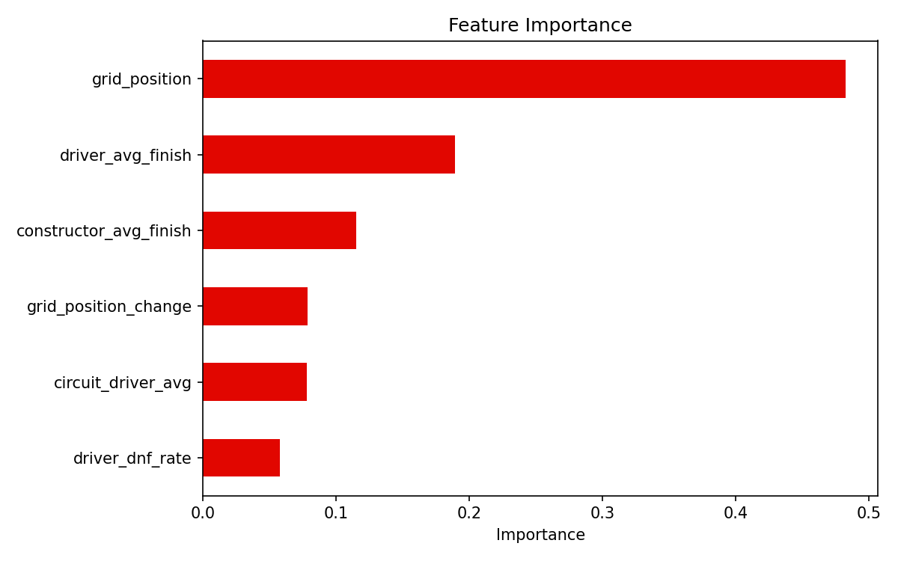
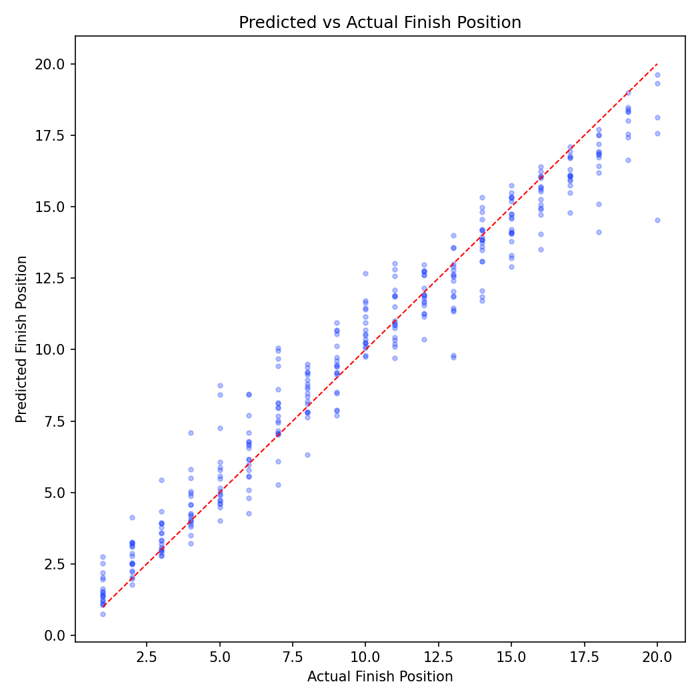
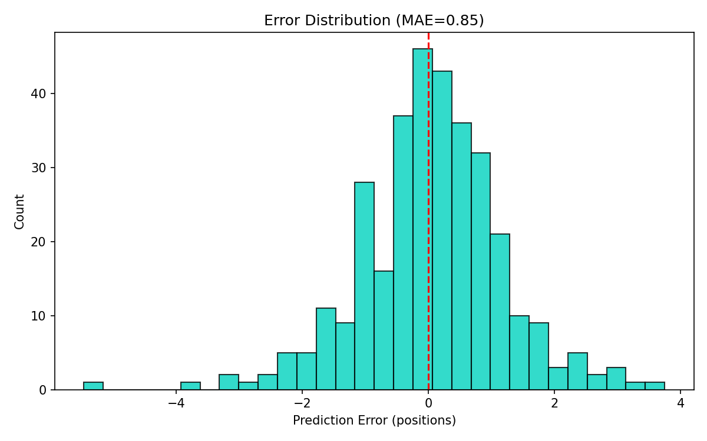
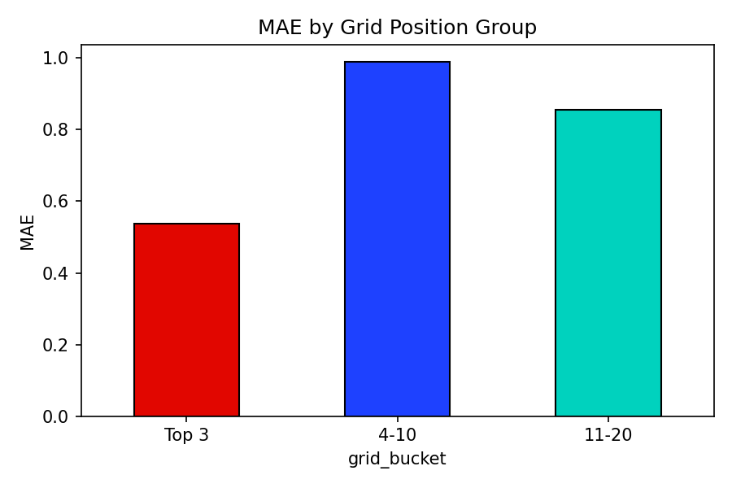

# 🏎️ F1 Race Position Predictor

A machine learning project that predicts Formula 1 race finishing positions using historical data from the [OpenF1 API](https://openf1.org). Built as an end-to-end ML pipeline — from data ingestion to interactive web demo.


> 🔗 **Live Demo**: [http://YOUR-ALB-URL.us-west-2.elb.amazonaws.com](http://YOUR-ALB-URL.us-west-2.elb.amazonaws.com)
>
> *(Replace with your actual ALB URL after deploying to AWS)*

---

## Problem Statement

Given a driver's grid (starting) position, their recent form, team performance, circuit history, and reliability record — can we predict where they'll finish the race?

This is a **tabular regression** problem with **time-series-aware feature engineering**, trained on 2023–2026 F1 season data.

## Architecture

```
┌──────────────┐     ┌──────────────────┐     ┌──────────────┐     ┌────────────┐
│  OpenF1 API  │────▶│  Feature Engine   │────▶│  XGBoost     │────▶│  Streamlit │
│  (Data)      │     │  (Rolling Stats)  │     │  (Training)  │     │  (Demo UI) │
└──────────────┘     └──────────────────┘     └──────────────┘     └────────────┘
```

## Features Used

| Feature | Description | Why It Matters |
|---------|-------------|----------------|
| `grid_position` | Starting grid position | Strongest predictor — front-runners usually finish near the front |
| `driver_avg_finish` | Rolling avg finish (last 5 races) | Captures current driver form |
| `constructor_avg_finish` | Rolling avg finish for team (last 5 races) | Car performance matters as much as driver skill |
| `circuit_driver_avg` | Driver's historical avg at this circuit | Some drivers excel at specific tracks |
| `driver_dnf_rate` | DNF rate over last 10 races | Reliability signal — frequent retirements hurt predictions |
| `grid_position_change` | Avg positions gained/lost from grid | Some drivers consistently overtake; others lose places |

All features use `shift(1)` to prevent data leakage — the model only sees information available before the race.

## Results

| Metric | Baseline (Grid = Finish) | XGBoost |
|--------|--------------------------|---------|
| MAE    | ~2.84 positions          | ~2.50 positions |


### Evaluation Plots

<p align="center">
  
  
</p>
<p align="center">
  
  
</p>

## Project Structure

```
f1-race-predictor/
├── src/
│   ├── data_fetcher.py        # OpenF1 API data collection + parsing
│   ├── features.py            # Feature engineering pipeline
│   ├── train.py               # Model training with time-series CV
│   ├── evaluate.py            # Evaluation metrics + visualizations
│   └── app.py                 # Streamlit interactive demo
├── data/
│   └── processed/             # Processed CSV (committed for reproducibility)
├── models/                    # Trained model artifacts
├── outputs/                   # Evaluation plots
├── deploy/
│   ├── cloudformation.yaml    # AWS ECS Fargate infrastructure
│   └── deploy.sh              # One-command AWS deployment
├── Dockerfile                 # Container for deployment
├── buildspec.yml              # AWS CodeBuild spec
├── requirements.txt
└── README.md
```

## Quick Start

```bash
# Clone and setup
git clone <repo-url>
cd f1-race-predictor
python3 -m venv venv && source venv/bin/activate
pip install -r requirements.txt

# Option A: Use pre-trained model (data + model already in repo)
(For self to run) Activate the venv first:
source .venv/bin/activate

Run the following command:
streamlit run src/app.py

# Option B: Train from scratch
python3 src/data_fetcher.py    # Fetch data from OpenF1 (~10 min, rate limited)
python3 src/train.py           # Train model
python3 src/evaluate.py        # Generate evaluation plots
streamlit run src/app.py       # Launch demo
```

## Deployment (AWS ECS Fargate)

The app is containerized and deployable to AWS with a single command:

```bash
./deploy/deploy.sh <aws-account-id> <region>
```

This creates: VPC → ALB (public) → ECS Fargate cluster → running container.
The ALB URL is publicly accessible — share it with anyone.

See [deploy/](deploy/) for the CloudFormation template and CodeBuild spec.

## Tech Stack

- **Data**: [OpenF1 API](https://openf1.org) — open-source F1 telemetry and results
- **ML**: XGBoost (gradient-boosted trees), scikit-learn (evaluation, CV)
- **Features**: pandas, numpy (rolling aggregations, time-series engineering)
- **Visualization**: Plotly (interactive charts), matplotlib (evaluation plots)
- **Demo**: Streamlit
- **Deployment**: Docker, AWS ECS Fargate, CloudFormation, CodeBuild

## Key Design Decisions

1. **Time-series split over random split** — F1 data is sequential. Random splits would leak future information into training.
2. **XGBoost over deep learning** — Tabular data with ~1800 rows. Tree-based models dominate here; neural nets would overfit.
3. **Rolling features with shift(1)** — Prevents data leakage. Every feature only uses information available before the race.
4. **Regression over classification** — Predicting exact position (1–20) as a continuous value, then rounding. More informative than bucketing into "podium/points/no points".

## Potential Improvements

- Add weather data (OpenF1 provides track/air temperature, rainfall)
- Include tire strategy features (compound choices, stint lengths)
- Incorporate qualifying lap times as a feature
- Ensemble with LightGBM or CatBoost
- Add MLflow for experiment tracking
- Implement model retraining pipeline triggered by new race data

## License

MIT
